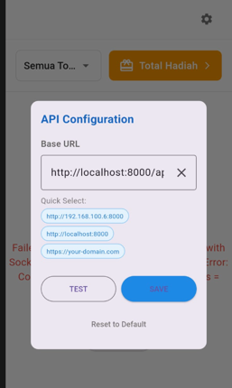

### Flutter Environment

Flutter 3.35.7 • channel stable

Tools • Dart 3.9.2 • DevTools 2.48.0

### WiFi Connection to Laravel Backend

To connect to your Laravel backend running on the same WiFi network:

1. **Find your computer's IP address:**
    - **Windows**: Run `ipconfig` in Command Prompt, look for "IPv4 Address"
    - **Mac/Linux**: Run `ifconfig` or `ip addr`, look for "inet"
    - Example: `192.168.1.100`

2. **Update Base URL in App:**
    - Tap the **Settings icon (⚙️)** in the top-right corner of apps
    - 
    - Change Base URL to: `http://[YOUR_IP_ADDRESS]:8000/api/v1`
    - Example: `http://192.168.1.100:8000/api/v1`
    - Tap **TEST CONNECTION** to verify
    - Tap **SAVE** to apply changes